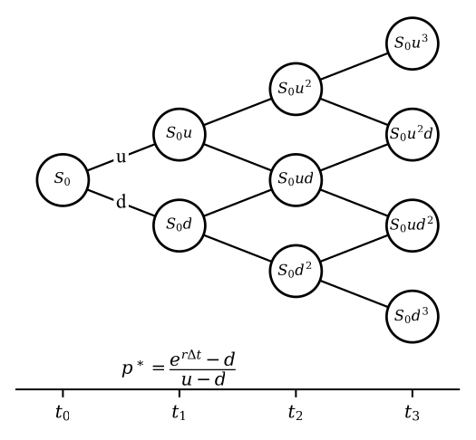
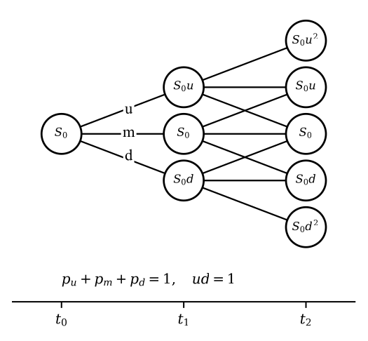
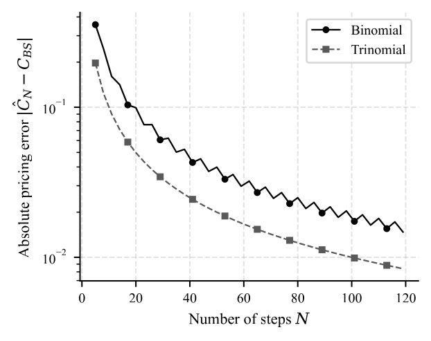

# Lattice Models

เปลี่ยนการเคลื่อนที่ของราคาให้เป็นต้นไม้เวลาไม่ต่อเนื่อง คำนวณย้อนหลัง และตรวจการลู่เข้าสู่คำตอบแบบต่อเนื่อง

## แบบจำลองต้นไม้ทวินาม (Binomial Tree, 1979)

แบบจำลองต้นไม้ทวินาม (Binomial Tree) ถูกเสนอโดย ค็อกซ์ (John C. Cox), รอสส์ (Stephen A. Ross) และ รูบินสไตน์ (Mark Rubinstein) (Cox et al. 1979) แบบจำลองก่อนหน้านี้ล้วนออกแบบสำหรับออปชันแบบยุโรปเท่านั้น แต่ไม่เหมาะกับการคำนวณมูลค่าออปชันแบบอเมริกัน จึงมีการเสนอการคำนวณด้วยแผนภาพต้นไม้ (tree) ซึ่งเหมาะกับการพิจารณาการใช้สิทธิล่วงหน้า (Early Exercise Premium) อันเป็นเหตุผลหนึ่งที่มูลค่าออปชันแบบอเมริกันที่ยังไม่ใช้สิทธิมีค่าสูงกว่าหรือเท่ากับออปชันแบบยุโรปที่เทียบเท่ากัน อย่างไรก็ตามในกรณีทั่วไปต้นไม้ไม่มีรูปแบบปิด และแม้ต้นไม้แบบรวมกิ่ง (recombining) จะมีจำนวนโหนดรวมเพียง $O(N^2)$ (ต่างจากจำนวน*เส้นทาง*ทั้งหมดซึ่งโตแบบ $2^N$) การคำนวณด้วยมือก็ยังทำได้ยากเมื่อจำนวนขั้นมาก วิธีการนี้ตั้งสมมติฐานว่าในแต่ละช่วงเวลาสั้น ๆ ราคาสินทรัพย์เคลื่อนที่ได้เพียงสองทิศทาง คือขึ้นด้วยตัวคูณ $u$ หรือลงด้วยตัวคูณ $d$ ทำให้มูลค่าสินทรัพย์ขึ้นกับเส้นทาง (path) และเวลาเป็นแบบไม่ต่อเนื่อง (discrete time) ดังแสดงในรูปที่ 1

<figure class="source-figure" id="fig:binomial" data-latex-placement="H">

<figcaption>รูปที่ 1 · ต้นไม้ทวินามแบบรวมกิ่ง (recombining binomial tree) สามช่วงเวลา แสดงราคาสินทรัพย์ <em>S</em>0<em>u</em><em>j</em><em>d</em><em>i</em> − <em>j</em> ณ โหนดต่าง ๆ พารามิเตอร์คงที่: $u=\mathrm{e}^{\sigma\sqrt{\Delta t}}$, <em>d</em> = 1/<em>u</em>, ความน่าจะเป็นเชิงกลาง-ความเสี่ยง <em>p</em>* = (e<em>r</em><em>Δ</em><em>t</em> − <em>d</em>)/(<em>u</em> − <em>d</em>). สังเกตว่าการเลื่อนขึ้นแล้วลงกลับมาที่โหนดเดียวกัน (recombining) ทำให้จำนวนโหนด ณ ขั้น <em>i</em> เท่ากับ <em>i</em> + 1 แทนที่จะเป็น 2<em>i</em>.</figcaption>
</figure>

**Proposition 11** (พารามิเตอร์และการเวียนซ้ำเชิงกลาง-ความเสี่ยง). *แบ่งช่วงเวลา $[0,T]$ เป็น $N$ ขั้นย่อยเท่า ๆ กัน $\Delta t = T/N$ กำหนด $$\begin{equation}
\label{eq:crr-params}
  u = \mathrm{e}^{\sigma\sqrt{\Delta t}}, \qquad d = \mathrm{e}^{-\sigma\sqrt{\Delta t}} = \frac1u,
  \qquad p^\ast = \frac{\mathrm{e}^{r\Delta t}-d}{u-d}.
\end{equation}$$ เมื่อ $\Delta t$ เล็กพอจะได้ $0<p^\ast<1$ และมูลค่าออปชันแบบยุโรป ณ โหนดใด ๆ สอดคล้องกับการเวียนซ้ำถอยหลัง (backward induction) $$\begin{equation}
\label{eq:crr-backward}
  V_i^{(j)} = \mathrm{e}^{-r\Delta t}\Big[p^\ast V_{i+1}^{(j+1)} + (1-p^\ast)V_{i+1}^{(j)}\Big],
\end{equation}$$ ในขณะที่ออปชันแบบอเมริกันแทนที่ด้วย $$\begin{equation}
\label{eq:crr-american}
  V_i^{(j)} = \max\!\Big\{\Lambda\big(S_0 u^{j} d^{i-j}\big),\;
  \mathrm{e}^{-r\Delta t}\big[p^\ast V_{i+1}^{(j+1)} + (1-p^\ast)V_{i+1}^{(j)}\big]\Big\}.
\end{equation}$$*

*Proof.* ค่า $p^\ast$ ถูกเลือกให้ราคาสินทรัพย์ที่คิดลดเป็นมาร์ทิงเกล กล่าวคือ $\mathbb{E}^{\mathbb{Q}}[S_{i+1}\mid S_i] = \mathrm{e}^{r\Delta t}S_i$ ซึ่งให้ $p^\ast u + (1-p^\ast)d = \mathrm{e}^{r\Delta t}$ แก้หาได้ [eq:crr-params]. ภายใต้มาตรวัดนี้มูลค่าออปชันคือค่าคาดหวังของมูลค่าขั้นถัดไปที่คิดลด นำไปสู่ [eq:crr-backward]. สำหรับออปชันอเมริกัน ณ แต่ละโหนดผู้ถือเลือกมูลค่าที่มากกว่าระหว่างการใช้สิทธิทันที $\Lambda(S)$ กับการถือต่อ (continuation value) จึงได้ [eq:crr-american]. เงื่อนไข $\mathrm{e}^{r\Delta t}\in(d,u)$ ที่ทำให้ $p^\ast\in(0,1)$ เป็นเงื่อนไขไร้การเก็งกำไรพอดี. ◻

## แบบจำลองต้นไม้ไตรนาม (Trinomial Tree, 1986)

แบบจำลองต้นไม้ไตรนาม (Trinomial Tree) ถูกเสนอโดย ฟีลิม บอยล์ (Phelim Boyle) (Boyle 1986) จากสมมติฐานเดิมของต้นไม้ทวินามที่ราคาสินทรัพย์มีเพียงสองทิศทาง บอยล์เสนอเพิ่มเส้นทางที่สามคือราคาคงที่ (middle) แม้จะเพิ่มความซับซ้อนในการคำนวณ แต่มีประโยชน์เพราะต้นไม้ไตรนามลู่เข้าสู่แบบจำลองแบล็ก-โชลส์อย่างราบเรียบกว่าและมีค่าคงตัวความคลาดเคลื่อนเล็กกว่าต้นไม้ทวินาม (อัตราการลู่เข้าเชิงอันดับเท่ากันคือ $O(1/N)$ ดูหัวข้อการลู่เข้าของแบบจำลองเชิงต้นไม้สู่แบล็ก-โชลส์ด้านล่าง) ดังแสดงในรูปที่ 2 ทั้งนี้เราขอละการอธิบายแบบจำลองอื่น ๆ ในตระกูลต้นไม้ เช่น implied trees, non-combining trees และ $N$-nomial trees

<figure class="source-figure" id="fig:trinomial" data-latex-placement="H">

<figcaption>รูปที่ 2 · ต้นไม้ไตรนามแบบรวมกิ่งสองช่วงเวลา แต่ละโหนดแตกออกเป็นสามทิศทาง (ขึ้น <em>u</em>, คงที่ <em>m</em>, ลง <em>d</em>) โดยกำหนด <em>u</em><em>d</em> = 1 เพื่อให้กิ่งรวมกันได้ ความน่าจะเป็น <em>p</em><em>u</em>, <em>p</em><em>m</em>, <em>p</em><em>d</em> รวมกันเท่ากับ 1 ตาม [eq:tri-probs]. โครงสร้างสามทิศทางทำให้มีโหนดที่ราคาตรงกับราคาใช้สิทธิ ช่วยลดความคลาดเคลื่อนในการกำหนดราคา.</figcaption>
</figure>

**Proposition 12** (พารามิเตอร์ต้นไม้ไตรนามของบอยล์). *กำหนด $\Delta t = T/N$ และ $$\begin{equation}
\label{eq:tri-params}
  u = \mathrm{e}^{\sigma\sqrt{2\Delta t}}, \qquad d = \frac1u,
\end{equation}$$ ความน่าจะเป็นเชิงกลาง-ความเสี่ยงของสามทิศทางคือ $$\begin{equation}
\label{eq:tri-probs}
  p_u = \left(\frac{\mathrm{e}^{r\Delta t/2}-\mathrm{e}^{-\sigma\sqrt{\Delta t/2}}}{\mathrm{e}^{\sigma\sqrt{\Delta t/2}}-\mathrm{e}^{-\sigma\sqrt{\Delta t/2}}}\right)^{\!2},
  \quad
  p_d = \left(\frac{\mathrm{e}^{\sigma\sqrt{\Delta t/2}}-\mathrm{e}^{r\Delta t/2}}{\mathrm{e}^{\sigma\sqrt{\Delta t/2}}-\mathrm{e}^{-\sigma\sqrt{\Delta t/2}}}\right)^{\!2},
  \quad
  p_m = 1-p_u-p_d.
\end{equation}$$ การเวียนซ้ำถอยหลังของมูลค่าออปชันคือ $V_i^{(j)} = \mathrm{e}^{-r\Delta t}\big[p_u V_{i+1}^{(j+1)} + p_m V_{i+1}^{(j)} + p_d V_{i+1}^{(j-1)}\big]$ (แทนด้วย $\max$ กับผลตอบแทนทันทีสำหรับออปชันอเมริกันเช่นเดียวกับ [eq:crr-american]).*

*Proof.* สร้างหนึ่งขั้นไตรนามจากสองขั้นทวินามครึ่งช่วงเวลาอย่างชัดแจ้ง: กำหนดตัวคูณครึ่งขั้น $a=\mathrm{e}^{\sigma\sqrt{\Delta t/2}}$ และความน่าจะเป็นครึ่งขั้นแบบ CRR (เทียบ [eq:crr-params] ที่ช่วงเวลา $\Delta t/2$) $$\begin{equation*}
  \tilde p = \frac{\mathrm{e}^{r\Delta t/2}-a^{-1}}{a-a^{-1}}.
\end{equation*}$$ การขึ้นสองครั้งติดกันให้ตัวคูณ $a^2 = \mathrm{e}^{\sigma\sqrt{2\Delta t}} = u$ ด้วยความน่าจะเป็น $\tilde p^{\,2}$ ซึ่งเท่ากับ $p_u$ ใน [eq:tri-probs] พอดี การลงสองครั้งให้ $d=1/u$ ด้วยความน่าจะเป็น $(1-\tilde p)^2 = p_d$ และกรณีผสม (ขึ้น-ลง หรือ ลง-ขึ้น) กลับสู่โหนดกลางด้วยความน่าจะเป็น $2\tilde p(1-\tilde p) = 1-p_u-p_d = p_m$. โครงสร้างนี้รับประกันเงื่อนไขมาร์ทิงเกล $\mathbb{E}[S_{i+1}\mid S_i] = \mathrm{e}^{r\Delta t}S_i$ โดยอัตโนมัติ เพราะแต่ละครึ่งขั้นเป็นมาร์ทิงเกลที่คิดลดตามบทตั้ง 11. สำหรับโมเมนต์ของผลตอบแทนล็อก การคำนวณโดยตรง (แสดงในบทพิสูจน์ผลสืบเนื่อง 15) ให้ $\mathbb{E}[\ln(S_{i+1}/S_i)] = (r-\tfrac12\sigma^2)\Delta t + O(\Delta t^2)$ และ $\mathop{\mathrm{Var}}[\ln(S_{i+1}/S_i)] = \sigma^2\Delta t + O(\Delta t^2)$ ตรงกับ GBM ถึงอันดับนำ. เงื่อนไข $p_u,p_m,p_d\ge 0$ เป็นจริงเมื่อ $\Delta t$ เล็กพอ (ต้องการ $\mathrm{e}^{r\Delta t/2}\in(a^{-1},a)$ ซึ่งเป็นเงื่อนไขไร้การเก็งกำไรต่อครึ่งขั้น). ◻

## การลู่เข้าของแบบจำลองเชิงต้นไม้สู่แบล็ก-โชลส์

ในหัวข้อนี้เราพิสูจน์ว่าเมื่อจำนวนขั้น $N\to\infty$ ราคาออปชันจากต้นไม้ทวินามและไตรนามลู่เข้าสู่ราคาจากแบบจำลองแบล็ก-โชลส์ กุญแจสำคัญคือทฤษฎีบทลิมิตกลาง (Central Limit Theorem, CLT) ที่ทำให้ผลรวมของผลตอบแทนล็อกในแต่ละขั้นลู่เข้าสู่การแจกแจงปกติ อันเป็นการกระจายตัวของ $\ln(S_T/S_0)$ ในแบบจำลองแบล็ก-โชลส์

**Assumption 13** (สมมติฐานที่จำเป็น). (i) พารามิเตอร์ $r,\sigma$ คงที่; (ii) ขั้นย่อยเป็นอิสระและกระจายตัวเหมือนกัน (i.i.d.) ภายใต้ $\mathbb{Q}$; (iii) ใช้พารามิเตอร์ CRR [eq:crr-params] สำหรับทวินาม และ [eq:tri-params]–[eq:tri-probs] สำหรับไตรนาม; (iv) ฟังก์ชันผลตอบแทน $\Lambda$ ต่อเนื่องและเติบโตไม่เกินเชิงเส้น เพื่อให้สลับลิมิตกับค่าคาดหวังได้ (uniform integrability).

**Theorem 14** (การลู่เข้าของต้นไม้ทวินาม). *ภายใต้สมมติฐาน 13 ราคาออปชันแบบยุโรปจากต้นไม้ทวินาม $C_N$ ลู่เข้าสู่ราคาแบล็ก-โชลส์ $C_{\mathrm{BS}}$ เมื่อ $N\to\infty$ $$\begin{equation}
\label{eq:conv-claim}
  \lim_{N\to\infty} C_N = C_{\mathrm{BS}}.
\end{equation}$$*

*Proof.* เขียนผลตอบแทนล็อกสะสม $\ln(S_T/S_0) = \sum_{i=1}^{N} X_i$ โดย $X_i$ รับค่า $\ln u = \sigma\sqrt{\Delta t}$ ด้วยความน่าจะเป็น $p^\ast$ และ $\ln d = -\sigma\sqrt{\Delta t}$ ด้วยความน่าจะเป็น $1-p^\ast$. กระจายอนุกรมของ $p^\ast$ ใน [eq:crr-params] รอบ $\Delta t=0$ $$\begin{equation*}
  p^\ast = \frac{\mathrm{e}^{r\Delta t}-\mathrm{e}^{-\sigma\sqrt{\Delta t}}}{\mathrm{e}^{\sigma\sqrt{\Delta t}}-\mathrm{e}^{-\sigma\sqrt{\Delta t}}}
  = \frac12 + \frac12\Big(\frac{r-\tfrac12\sigma^2}{\sigma}\Big)\sqrt{\Delta t} + O(\Delta t^{3/2}).
\end{equation*}$$ จากนั้นคำนวณโมเมนต์ต่อขั้น $$\begin{align*}
  \mathbb{E}[X_i] &= (2p^\ast-1)\sigma\sqrt{\Delta t} = \big(r-\tfrac12\sigma^2\big)\Delta t + O(\Delta t^2),\\
  \mathop{\mathrm{Var}}[X_i] &= \sigma^2\Delta t - \mathbb{E}[X_i]^2 = \sigma^2\Delta t + O(\Delta t^2).
\end{align*}$$ รวม $N=T/\Delta t$ ขั้นได้ค่าเฉลี่ยรวม $\mu_N = \sum\mathbb{E}[X_i] \to (r-\tfrac12\sigma^2)T$ และความแปรปรวนรวม $s_N^2 = \sum\mathop{\mathrm{Var}}[X_i] \to \sigma^2 T$. เนื่องจาก $X_i$ มีขอบเขต ($|X_i|=\sigma\sqrt{\Delta t}\to 0$) เงื่อนไขลินเดอเบิร์ก (Lindeberg condition) เป็นจริง กล่าวคือสำหรับทุก $\epsilon>0$ $$\begin{equation*}
  \frac{1}{s_N^2}\sum_{i=1}^{N}\mathbb{E}\!\big[(X_i-\mathbb{E}X_i)^2\,\mathbf{1}_{\{|X_i-\mathbb{E}X_i|>\epsilon s_N\}}\big]\to 0,
\end{equation*}$$ เพราะเมื่อ $N$ ใหญ่พอ $|X_i-\mathbb{E}X_i|\le 2\sigma\sqrt{\Delta t} < \epsilon s_N$ ทำให้ตัวชี้บ่ง (indicator) เป็นศูนย์ทั้งหมด. โดยทฤษฎีบทลินเดอเบิร์ก-เฟลเลอร์ (Lindeberg-Feller CLT) $$\begin{equation*}
  \sum_{i=1}^N X_i \xrightarrow{\;d\;} \mathcal{N}\!\big((r-\tfrac12\sigma^2)T,\ \sigma^2 T\big),
\end{equation*}$$ ซึ่งตรงกับการแจกแจงของ $\ln(S_T/S_0)$ ในแบบจำลองแบล็ก-โชลส์พอดี. โดยทฤษฎีบทการส่งต่อเนื่อง (continuous mapping theorem) และความต่อเนื่องของ $\Lambda$ จะได้ $\Lambda(S_T^{(N)})$ ลู่เข้าในการแจกแจงสู่ $\Lambda(S_T)$ เหลือเพียงตรวจสอบความอินทิเกรตได้อย่างเอกรูป (uniform integrability) ซึ่งพิสูจน์ได้จริงจากขอบเขตโมเมนต์ที่สอง: เนื่องจาก $ud=1$ $$\begin{equation*}
  \mathbb{E}\big[(S_T^{(N)})^2\big] = S_0^2\big[p^\ast u^2 + (1-p^\ast)d^2\big]^N
  = S_0^2\big[\mathrm{e}^{r\Delta t}(u+d) - 1\big]^N
  = S_0^2\big[1+(2r+\sigma^2)\Delta t + O(\Delta t^2)\big]^N,
\end{equation*}$$ ดังนั้น $\sup_N \mathbb{E}[(S_T^{(N)})^2] \le S_0^2\,\mathrm{e}^{(2r+\sigma^2)T + O(\Delta t)} < \infty$. ขอบเขตโมเมนต์ที่สองอย่างสม่ำเสมอร่วมกับการเติบโตไม่เกินเชิงเส้นของ $\Lambda$ ตามสมมติฐาน 13(iv) ให้ uniform integrability ของ $\{\Lambda(S_T^{(N)})\}_N$ การลู่เข้าในการแจกแจงจึงส่งผลให้ค่าคาดหวังของผลตอบแทนที่คิดลดลู่เข้า และได้ [eq:conv-claim]. ◻

**Corollary 15** (การลู่เข้าของต้นไม้ไตรนาม). *ภายใต้สมมติฐาน 13 ราคาจากต้นไม้ไตรนามลู่เข้าสู่ $C_{\mathrm{BS}}$ เช่นกัน โดยผลตอบแทนต่อขั้น $X_i$ รับสามค่า $\{\sigma\sqrt{2\Delta t},0,-\sigma\sqrt{2\Delta t}\}$ ด้วยความน่าจะเป็น $\{p_u,p_m,p_d\}$ ซึ่งจับคู่โมเมนต์ที่หนึ่งและที่สองให้ตรงกับ GBM ทำให้เงื่อนไขลินเดอเบิร์กเป็นจริงด้วยเหตุผลเดียวกัน.*

*Proof.* จากนิยาม [eq:tri-probs] เขียน $a=\mathrm{e}^{\sigma\sqrt{\Delta t/2}}$ ผลต่างของกำลังสองให้ $$\begin{equation*}
  p_u - p_d = \frac{(\mathrm{e}^{r\Delta t/2}-a^{-1})^2 - (a-\mathrm{e}^{r\Delta t/2})^2}{(a-a^{-1})^2}
  = \frac{2\mathrm{e}^{r\Delta t/2} - a - a^{-1}}{a-a^{-1}}
  = \Big(\frac{r-\tfrac12\sigma^2}{2\sigma}\Big)\sqrt{2\Delta t} + O(\Delta t^{3/2}),
\end{equation*}$$ โดยกระจายอนุกรม $2\mathrm{e}^{r\Delta t/2}-a-a^{-1} = (r-\tfrac12\sigma^2)\Delta t + O(\Delta t^2)$ และ $a-a^{-1} = \sigma\sqrt{2\Delta t} + O(\Delta t^{3/2})$. ดังนั้น $\mathbb{E}[X_i] = (p_u-p_d)\sigma\sqrt{2\Delta t} = (r-\tfrac12\sigma^2)\Delta t + O(\Delta t^2)$ และ $\mathop{\mathrm{Var}}[X_i] = (p_u+p_d)\cdot 2\sigma^2\Delta t - \mathbb{E}[X_i]^2 = \sigma^2\Delta t + O(\Delta t^2)$ (ใช้ $p_u+p_d = \tfrac12 + O(\Delta t)$) ที่เหลือเหมือนบทพิสูจน์ทฤษฎีบท 14. ◻

*Remark 16*. ทฤษฎีบท 14 และผลสืบเนื่อง 15 ครอบคลุมเฉพาะออปชันแบบ*ยุโรป* การลู่เข้าของราคาออปชันแบบ*อเมริกัน*จากแบบจำลองเชิงต้นไม้สู่มูลค่าการหยุดเหมาะสมในเวลาต่อเนื่อง [eq:am-price] เป็นผลลัพธ์ที่ลึกกว่าและต้องอาศัยเทคนิคเพิ่มเติม ดูบทพิสูจน์ของอามินและคานนา (Amin and Khanna 1994).

### อัตราการลู่เข้า (เชิงคณิตศาสตร์และเชิงคำนวณ)

เชิงคณิตศาสตร์ ทั้งสองแบบจำลองมีอัตราการลู่เข้าอันดับหนึ่ง $|C_N - C_{\mathrm{BS}}| = O(1/N)$ แต่ต้นไม้ทวินามมีองค์ประกอบ *แกว่ง* (oscillatory) แบบฟันเลื่อยตามภาวะคู่/คี่ของ $N$ เนื่องจากตำแหน่งของราคาใช้สิทธิ $K$ เทียบกับโหนดปลายทางสลับไปมา ในทางตรงข้ามต้นไม้ไตรนามมีโหนดกลางที่จัดวางให้ตรงกับ $K$ ได้ดีกว่า จึงลู่เข้าอย่างราบเรียบและมีค่าคงตัวคลาดเคลื่อนเล็กกว่า รูปที่ 3 ยืนยันข้อสังเกตนี้เชิงคำนวณ โดยแสดงความคลาดเคลื่อนสัมบูรณ์เทียบกับจำนวนขั้นในมาตราส่วนล็อก

<figure class="source-figure" id="fig:conv" data-latex-placement="H">

<figcaption>รูปที่ 3 · ความคลาดเคลื่อนสัมบูรณ์ |<em>Ĉ</em><em>N</em> − <em>C</em>BS| ของการกำหนดราคาออปชันซื้อแบบยุโรป (พารามิเตอร์คงที่: <em>S</em>0 = <em>K</em> = 100, <em>r</em> = 0.05, <em>σ</em> = 0.20, <em>T</em> = 1) เทียบกับจำนวนขั้น <em>N</em> ในมาตราส่วนกึ่งล็อก สังเกตการแกว่งแบบฟันเลื่อยของต้นไม้ทวินาม (เส้นทึบ) เทียบกับการลู่เข้าที่ราบเรียบและเร็วกว่าของต้นไม้ไตรนาม (เส้นประ) ซึ่งสอดคล้องกับการวิเคราะห์เชิงทฤษฎี.</figcaption>
</figure>

## ทดลองต้นไม้ Binomial

เปิด JavaScript เพื่อปรับค่าห้องทดลองนี้ สมการและตัวอย่างในบทอ่านได้ตามปกติ

## จำนวนขั้นและการลู่เข้า

เปิด JavaScript เพื่อปรับค่าห้องทดลองนี้ สมการและตัวอย่างในบทอ่านได้ตามปกติ

